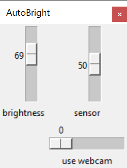

# mini_proj_screen_brightness

Mini projet pour cours logique floue. 

Contrôleur de luminosité d'écran utilisant un fuzzy controller et un ajustement des C-Means quand l'utilisateur ajuste manuellement la luminosité de son écran soit par les contrôles Windows ou directement dans l'application.

L'application avait été pensé pour utiliser un capteur réel de luminosité ambiante mais pour la première ébauche, un simulateur est utilisé sous la forme d'un slider graphique dans l'application.

lib pythons utilisées:
- numpy
- scikit-fuzzy
- tkinter
- screen_brightness_control
- fuzzy-c-means
- matplotlib
- opencv-python
  - dernière version de cv2 (4.6) ne marche pas, utiliser cette commande pour installer une version fonctionnelle:
  - ``pip install --force-reinstall --no-cache -U opencv-python==4.5.5.62   ``

### Fonctionnement du code :

Le contrôleur de logique floue a deux entrées et une sortie.

Entrées du contrôleur
  - input
  - forced

Input est la valeur de luminosité initiale que l'écran devrait avoir selon la luminosité ambiante.

Forced est la préférence relative de l'utilisateur sur un range de -10 à 10. Par exemple, si la valeur de préférence est de -5 et que la valeur initiale de luminosité de l'écran est de 50, on s'attend à une valeur finale un peu inférieure.

Comment déterminer la préférence de l'utilisateur :

Chaque fois que l'utilisateur modifie la valeur de luminosité de son écran avec le "slider", la différence entre la valeur initiale et la valeur finale du slider est mise dans un array. Ce array est ensuite envoyer vers une fonction c-means pour trouver les centres de ce cluster 1D pour déterminer la tendance des préférences.

Ces centres déterminés permettent de modifier les fonctions d'appartenance pour l'entrée "forced".

### Utilisation de l'application :

**Slider `brightness`**: 
- Sortie du contrôleur fuzzy, correspond à l'éclairage de l'écran actuel
- Sert également de override utilisateur pour recalculer les C-Means
- L'utilisateur peut utiliser le contrôle d'éclairage d'écran de l'OS également pour ajuster cette valeur
- Après 1 seconde d'inactivité de l'utilisateur sur le contrôle, la valeur finale de l'ajustement est utilisée pour calculer l'override C-Means

**Slider `use webcam`**:
- `0` : Utilise la valeur du slider `sensor` comme input
- `1` : Utilise la webcam pour simuler un luxomètre à l'aide la librairie OpenCV

**Slider `sensor`**:
- Affiche la valeur d'entrée du contrôleur fuzzy
- Quand slider `use webcam` à `0` : peut être contrôler pour changer directement l'entrée du système
- Quand slider `use webcam` à `1` : affiche l'estimation en % du capteur luxomètre simulé